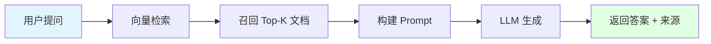

<div align="center">

# 🤖 LLM Local Deployment & RAG System

**人工智能课程设计 | AI Course Design Project**

*本地化大模型部署 + 检索增强生成（RAG）实践*

---

[](https://www.python.org/)
[](https://pytorch.org/)
[](https://www.langchain.com/)
[](https://github.com/PanQiWei/AutoGPTQ)

</div>

---

## 📖 项目简介

本项目是人工智能课程的**课程设计作品**，构建了一个基于 RAG 技术的 **AI 课程智能助手**，帮助学生快速查询课程信息、实验指导和技术问题。

### 🎯 应用场景

**AI 课程智能助手** - 为人工智能课程提供智能问答服务：
- 📚 **课程信息查询**: 课程大纲、考试范围、作业要求
- 🔬 **实验指导**: 实验步骤、环境配置、常见问题
- 💻 **代码示例**: Python 机器学习代码库
- ❓ **FAQ 问答**: 课程相关的常见问题解答
- 👥 **班级信息**: 班级花名册、班委信息（演示私有数据检索）

### 🎯 核心目标

本项目完整实现了大模型应用开发的三大核心任务：

#### 1️⃣ 本地化大模型部署
- ✅ 搭建 GPU + Python + 推理框架运行环境
- ✅ 从 ModelScope 拉取 Qwen2.5-7B-Instruct-GPTQ-Int4 量化模型
- ✅ 部署本地推理服务并验证推理能力

#### 2️⃣ API 调用实现问答功能
- ✅ 封装大模型推理接口为 RESTful API
- ✅ 支持多轮对话模式
- ✅ 观察并优化模型响应质量

#### 3️⃣ 增强检索式问答（RAG）
**选项 B：基于 LangChain 实现 RAG**
- ✅ 构建文本向量化与知识库（FAISS）
- ✅ 集成本地模型与向量检索模块
- ✅ 使用课程文档知识库（课程大纲、实验指导、FAQ 等）
- ✅ 结合班级花名册演示私有数据检索能力
- ✅ 优化提示词与召回策略

---

## 🏗️ 系统架构

```
┌─────────────────────────────────────────────────────────┐
│                    前端交互层                              │
│  ┌──────────────┐  ┌──────────────┐  ┌──────────────┐  │
│  │ rag_chat.html│  │  chat.html   │  │terminal_chat │  │
│  │   (RAG UI)   │  │  (普通对话)   │  │    (CLI)     │  │
│  └──────────────┘  └──────────────┘  └──────────────┘  │
└─────────────────────────────────────────────────────────┘
                           ↓ HTTP
┌─────────────────────────────────────────────────────────┐
│                    API 服务层                             │
│  ┌──────────────────────────────────────────────────┐   │
│  │           Flask Server (rag_server.py)           │   │
│  │  • /rag_chat  • /chat  • /health                 │   │
│  └──────────────────────────────────────────────────┘   │
└─────────────────────────────────────────────────────────┘
                           ↓
┌─────────────────────────────────────────────────────────┐
│                   核心处理层                              │
│  ┌─────────────┐  ┌──────────────┐  ┌───────────────┐  │
│  │   LangChain │→ │ FAISS Vector │→ │   Document    │  │
│  │   RAG Chain │  │   Retriever  │  │   Loader      │  │
│  └─────────────┘  └──────────────┘  └───────────────┘  │
│         ↓                                                │
│  ┌──────────────────────────────────────────────────┐   │
│  │      Qwen2.5-7B-Instruct-GPTQ-Int4               │   │
│  │      (AutoGPTQ + Transformers)                   │   │
│  └──────────────────────────────────────────────────┘   │
└─────────────────────────────────────────────────────────┘
                           ↓
┌─────────────────────────────────────────────────────────┐
│                   存储层                                  │
│  ┌──────────────┐  ┌──────────────┐  ┌───────────────┐ │
│  │   models/    │  │ vector_store/│  │knowledge_base/│ │
│  │  (模型文件)   │  │  (向量索引)   │  │  (文档数据)   │ │
│  └──────────────┘  └──────────────┘  └───────────────┘ │
└─────────────────────────────────────────────────────────┘
```

---

## 🛠️ 环境配置

### 📋 依赖环境

| 组件 | 版本 | 说明 |
|:---:|:---:|:---|
| **Python** | 3.10 | 基础环境 |
| **CUDA** | 12.1 | GPU 加速 |
| **PyTorch** | 2.1.2 | 深度学习框架 |
| **AutoGPTQ** | 0.6.0 | 量化模型推理 |
| **Transformers** | 4.45.2 | HuggingFace 模型库 |
| **LangChain** | Latest | RAG 框架 |
| **FAISS** | GPU 版 | 向量相似度检索 |
| **Flask** | Latest | Web 服务框架 |

### ⚙️ 安装指南

```bash
# 1. 创建 Conda 环境
conda create -n llm_deploy python=3.10
conda activate llm_deploy

# 2. 安装 PyTorch (根据实际 CUDA 版本调整)
pip install torch==2.1.2 torchvision==0.16.2 torchaudio==2.1.2 \
    --index-url https://download.pytorch.org/whl/cu121

# 3. 安装量化推理框架
pip install auto-gptq transformers

# 4. 安装 RAG 相关库
pip install langchain langchain-community langchain-huggingface \
    sentence-transformers faiss-gpu

# 5. 安装 Web 服务框架
pip install flask flask-cors

# 6. 安装 ModelScope（模型下载）
pip install modelscope
```

---

## 📁 项目结构

```
LLM_DEPLOY/
│
├── 📓 notebooks/                   # Jupyter Notebooks
│   ├── 01_model_setup.ipynb        # 模型部署与环境验证
│   └── 02_rag_implementation.ipynb # RAG 系统构建与测试
│
├── 🌐 web/                         # Web 前端
│   ├── rag_chat.html               # RAG 问答前端界面
│   └── chat.html                   # 普通对话前端界面
│
├── 🔧 src/                         # 服务端代码
│   ├── rag_server.py               # Flask API 后端（端口 6006）
│   ├── api_server.py               # 备用 API 服务
│   └── terminal_chat.py            # 命令行对话工具
│
├── 💾 数据存储
│   ├── models/                     # LLM 模型文件缓存
│   ├── vector_store/               # FAISS 向量数据库
│   └── knowledge_base/             # 课程知识库 + 私有数据
│       ├── course_syllabus.md      # 课程大纲
│       ├── course_faq.md           # 常见问题解答
│       ├── lab05_rag_guide.md      # 实验指导书
│       ├── python_ml_examples.md   # 代码示例
│       ├── class_roster_cs23-3.txt # 班级花名册（化名）
│       └── README.md               # 知识库说明
│
├── 📄 config/                      # 配置文件
│   └── environment.yml             # Conda 环境配置
│
├── 📚 docs/                        # 项目文档
│   └── README.md                   # 文档目录
│
├── .gitignore                      # Git 忽略规则
└── 📖 README.md                    # 本文档
```

---

## 🚀 快速开始

### 步骤 1: 模型部署

打开 Jupyter Notebook 并运行：

```bash
jupyter notebook notebooks/01_model_setup.ipynb
```

执行所有单元格，确保：
- ✅ GPU 环境正常
- ✅ Qwen2.5 模型下载完成
- ✅ 模型推理测试通过

### 步骤 2: 构建知识库

1. **准备文档**: 将您的文档（.txt / .pdf / .md）放入 `knowledge_base/` 目录

2. **向量化处理**: 运行 `notebooks/02_rag_implementation.ipynb`

   ```python
   # Notebook 中会自动执行：
   # - 文档加载
   # - 文本分块
   # - 向量化
   # - FAISS 索引构建
   ```

3. **验证索引**: 确认 `vector_store/` 目录生成索引文件

### 步骤 3: 启动服务

在终端运行：

```bash
python src/rag_server.py
```

看到以下输出表示启动成功：

```
🚀 RAG 系统初始化完成！
🌐 RAG API 服务器启动中...
📍 访问地址: http://localhost:6006
```

### 步骤 4: 开始对话

**方式 1 - Web 界面（推荐）**

直接在浏览器打开 `web/rag_chat.html` 文件：

- 🔵 **RAG 模式**: 基于课程知识库回答
- ⚪ **普通模式**: 直接调用大模型

**方式 2 - 命令行**

```bash
python src/terminal_chat.py
```

---

## 🔍 核心功能演示

### 功能 1: 基于 RAG 的知识库问答

**场景 A**: 查询课程信息

```
👤 用户: 人工智能课程的考核方式是什么？

🤖 助手: 根据课程大纲，考核方式包括：
- 平时成绩（20%）：出勤、课堂表现、作业
- 实验成绩（30%）：5 次实验报告
- 课程设计（20%）：大模型部署与 RAG 实现
- 期末考试（30%）：闭卷考试

📚 参考来源:
  [1] course_syllabus.md - 考核方式章节
```

**场景 B**: 查询私有数据（班级花名册）

```
👤 用户: 23-3班的学习委员是谁？

🤖 助手: 根据班级花名册，23-3班的学习委员是李明辉（学号：2023217373）。

📚 参考来源:
  [1] class_roster_cs23-3.txt - 班级特色章节
```

### 功能 2: 普通对话

```
👤 用户: 介绍一下 Transformer 架构

🤖 助手: Transformer 是一种基于自注意力机制的神经网络架构...
```

### 功能 3: API 调用示例

```python
import requests

# RAG 问答
response = requests.post('http://localhost:6006/rag_chat', json={
    'query': '如何安装 PyTorch？',
    'k': 3  # 检索 top-3 文档
})

print(response.json()['response'])
```

---

## 📊 技术细节

### RAG 流程详解



1. **向量检索**: 使用 `text2vec-base-chinese` 模型将问题转换为向量
2. **相似度匹配**: FAISS 检索最相关的 Top-K 文档片段
3. **上下文注入**: 将检索结果作为上下文提供给 LLM
4. **生成回答**: Qwen2.5 基于上下文生成准确回答
5. **来源标注**: 返回答案并附带引用来源

### 提示词模板

```python
prompt = f"""你是一个专业的技术助手。请根据以下参考资料回答问题。

要求：
1. 如果参考资料中有相关信息，基于资料给出准确回答
2. 如果参考资料中没有相关信息，明确说明"参考资料中没有相关信息"
3. 回答要简洁清晰，条理分明

{context}

【问题】
{query}

【回答】"""
```

---

## 🎓 课程设计总结

### 完成情况

| 任务 | 完成度 | 说明 |
|:---:|:---:|:---|
| **任务 1: 本地化部署** | ✅ 100% | Qwen2.5-7B 量化模型部署成功 |
| **任务 2: API 问答** | ✅ 100% | Flask API + 多轮对话支持 |
| **任务 3: RAG 实现** | ✅ 100% | LangChain + FAISS + 私有数据 |

### 技术亮点

- 🚀 **高效推理**: 使用 GPTQ-Int4 量化，显存占用仅 ~5GB
- 🔍 **精准检索**: FAISS GPU 加速，检索延迟 < 50ms
- 🎨 **友好界面**: 现代化 Web UI，支持流式输出效果
- 📚 **私有知识**: 支持自定义文档，零代码导入

### 学习收获

1. **模型部署**: 掌握量化模型的加载与推理
2. **RAG 原理**: 理解检索增强生成的核心流程
3. **LangChain 应用**: 熟悉向量存储、文档加载、链式调用
4. **API 开发**: 完成从后端到前端的完整应用

---

## 🐛 故障排除

### 常见问题

**Q1: 显存不足 (CUDA Out of Memory)**
```bash
# 解决方案 1: 使用更小的模型
model = AutoModelForCausalLM.from_pretrained(..., device_map="auto")

# 解决方案 2: Embedding 使用 CPU
embedding_model = HuggingFaceEmbeddings(model_kwargs={'device': 'cpu'})
```

**Q2: 向量库加载失败**
```bash
# 确保先运行 notebooks/02_rag_implementation.ipynb 构建向量库
# 检查 vector_store/ 目录是否存在 index.faiss 和 index.pkl
```

**Q3: API 连接超时**
```bash
# 检查服务是否正常启动
curl http://localhost:6006/health
```

---

## 📚 参考资料

- [Qwen2.5 模型文档](https://github.com/QwenLM/Qwen2.5)
- [LangChain 官方文档](https://python.langchain.com/)
- [AutoGPTQ GitHub](https://github.com/PanQiWei/AutoGPTQ)
- [FAISS 官方文档](https://github.com/facebookresearch/faiss)

---

<div align="center">

**🎓 Course Design Project - 2025**

*Made with ❤️ for AI Learning*

</div>
