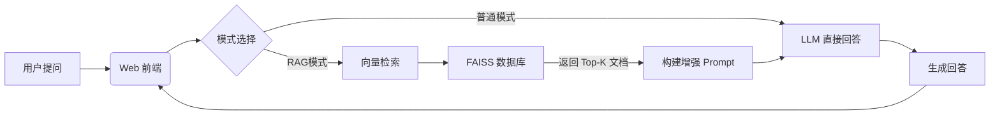

# 人工智能课程设计报告

**项目名称**：基于本地大模型与 RAG 技术的 AI 课程智能助手  
**学生姓名**：[你的姓名]  
**学号**：[你的学号]  
**班级**：[你的班级]  
**日期**：2025年12月19日

---

## 目录

1. [实验任务与目标](#1-实验任务与目标)
2. [总体系统设计](#2-总体系统设计)
3. [详细实现过程](#3-详细实现过程)
    *   [3.1 本地环境搭建](#31-本地环境搭建)
    *   [3.2 本地化大模型部署](#32-本地化大模型部署)
    *   [3.3 向量知识库构建](#33-向量知识库构建)
    *   [3.4 RAG 检索增强生成实现](#34-rag-检索增强生成实现)
4. [前端交互系统设计](#4-前端交互系统设计)
    *   [4.1 现代化 UI 设计](#41-现代化-ui-设计)
    *   [4.2 核心功能展示](#42-核心功能展示)
5. [系统测试与效果验证](#5-系统测试与效果验证)
    *   [5.1 基础能力测试](#51-基础能力测试)
    *   [5.2 RAG 模式对比测试（核心）](#52-rag-模式对比测试核心)
    *   [5.3 私有知识库验证](#53-私有知识库验证)
6. [遇到的问题与解决方案](#6-遇到的问题与解决方案)
7. [总结与心得](#7-总结与心得)

---

## 1. 实验任务与目标

本次课程设计旨在通过实践掌握大语言模型（LLM）的本地化部署与应用开发技术。主要包含以下三个核心任务：

1.  **本地化大模型部署**：搭建 GPU 推理环境，拉取开源模型（Qwen2.5），并完成本地推理服务的部署，验证模型的基础推理能力。
2.  **API 问答功能**：基于 Flask 封装大模型推理接口，实现支持多轮对话的 RESTful API，并开发前端界面进行交互。
3.  **增强检索式问答 (RAG)**：基于 LangChain 框架和 FAISS 向量数据库，引入私有知识库（模拟的班级档案），解决大模型的知识幻觉问题，实现基于私有数据的精准问答，并提供**RAG开关对比**功能。

---

## 2. 总体系统设计

### 2.1 技术架构
本项目采用典型的 RAG（Retrieval-Augmented Generation）架构，结合前后端分离的设计模式。

*   **模型层 (Model Layer)**:
    *   **LLM**: `Qwen2.5-7B-Instruct-GPTQ-Int4`。选用 4-bit 量化版本，在保证推理精度的同时，将显存需求降低至 6GB 左右，适合本地部署。
    *   **Embedding**: `text2vec-base-chinese`。一款高性能的中文文本向量化模型，将文本转换为 768 维向量。
*   **数据层 (Data Layer)**:
    *   **向量数据库**: `FAISS` (Facebook AI Similarity Search)。用于存储和快速检索知识库向量。
    *   **私有知识库**: 包含三个班级（红楼、水浒、三国主题）的详细档案数据。
*   **服务层 (Service Layer)**:
    *   **Flask**: 提供 RESTful API 接口 (`/chat`, `/rag_chat`)。
    *   **LangChain**: 负责 RAG 流程的编排（文档加载 -> 切分 -> 检索 -> 生成）。
*   **交互层 (UI Layer)**:
    *   **HTML5 + Tailwind CSS**: 构建现代化的 Web 界面。
    *   **Glassmorphism**: 采用玻璃拟态设计风格，提升视觉体验。
    *   **Marked.js + Highlight.js**: 实现 Markdown 渲染和代码语法高亮。

### 2.2 数据流向图

---

## 3. 详细实现过程

### 3.1 本地环境搭建
项目运行在 Windows 环境下，使用 Conda 进行虚拟环境管理。
*   **Python**: 3.10
*   **PyTorch**: 2.1.2 + CUDA 12.1
*   **关键依赖**: `auto-gptq`, `transformers`, `langchain`, `flask`

**环境配置截图：**

### 3.2 本地化大模型部署
使用 `modelscope` 下载模型，并通过 `AutoGPTQ` 加载。
*   **模型路径**: `models/Qwen/Qwen2.5-7B-Instruct-GPTQ-Int4`
*   **加载策略**: `device_map="auto"` 自动分配显存。

**模型文件截图：**

### 3.3 向量知识库构建
为了验证 RAG 对私有数据的支持，构建了极具特色的**三大名著主题班级档案**：
1.  **CS23-1 (红楼梦)**: 包含贾宝玉、林黛玉等人的宿舍、特长信息。
2.  **CS23-2 (水浒传)**: 包含宋江、林冲等人的绰号、技能信息。
3.  **CS23-3 (三国演义)**: 包含刘备、诸葛亮等人的辅导员、大事件信息。

**知识库文件截图：**

使用 `rebuild_vector_store.py` 脚本，将这些文本切分为 500 字符的块，转换为向量并存入 FAISS。

**向量构建截图：**

### 3.4 RAG 检索增强生成实现
在 `src/rag_server.py` 中实现了完整的 RAG 逻辑：
1.  接收用户 Query。
2.  在 FAISS 中检索 Top-3 相关文档。
3.  将文档内容作为 Context 拼接到 System Prompt 中。
4.  LLM 根据 Context 生成回答，并附带参考来源。

---

## 4. 前端交互系统设计

为了提供优秀的用户体验，本项目开发了功能完善的 Web 交互界面 (`rag_chat.html`)。

### 4.1 现代化 UI 设计
*   **玻璃拟态**: 背景采用动态渐变 + 模糊效果，卡片半透明，极具现代感。
*   **响应式布局**: 适配不同屏幕尺寸。
*   **交互动画**: 发送消息时的打字机效果、按钮悬停效果。

### 4.2 核心功能展示
1.  **Markdown 渲染**: 支持标题、列表、表格的完美渲染。
2.  **代码高亮**: 模型生成的代码块会自动识别语言并高亮显示。
3.  **RAG 开关切换**: 界面顶部提供“RAG 增强模式”与“普通对话模式”的切换按钮，方便用户直观对比效果。
4.  **来源溯源**: 在 RAG 模式下，回答下方会以卡片形式展示参考的文档来源，增强可信度。

**Web 界面功能展示截图：**

---

## 5. 系统测试与效果验证

### 5.1 基础能力测试
启动 API 服务后，首先测试模型的通用对话能力和代码生成能力。
**测试问题**: "请写一个 Python 的快速排序算法。"
**结果**: 模型能生成正确的 Python 代码，且前端正确进行了语法高亮。

**API 启动截图：**

### 5.2 RAG 模式对比测试（核心）
这是验证本项目成果的关键环节。我们通过**开启**和**关闭** RAG 模式，对比模型对私有数据的回答情况。

**测试问题**: **"计算机科学与技术23-3班的辅导员是谁？"**

#### 场景 A：普通模式（关闭 RAG）
*   **原理**: 模型仅依靠预训练知识（互联网公开数据）。
*   **结果**: 模型无法回答，或者产生幻觉（胡编乱造一个名字）。
*   **截图证明**:
    

#### 场景 B：RAG 增强模式（开启 RAG）
*   **原理**: 系统先检索 `cs_23_3.txt`，找到“辅导员: 诸葛亮”相关片段，再提交给模型。
*   **结果**: 模型准确回答：“计算机科学与技术23-3班的辅导员是诸葛亮，电话是 136-xxxx-9999。”
*   **截图证明**:
    

### 5.3 私有知识库验证
进一步验证系统对细节信息的检索能力。
**测试问题**: "谁住在 5号楼-203 宿舍？"
**结果**: 系统检索 `cs_23_1.txt`，准确回答出“韩梅梅”和“林黛玉”，并展示参考来源。

**来源溯源截图：**

---

## 6. 遇到的问题与解决方案

1.  **问题**: `AutoGPTQ` 安装困难，与 PyTorch 版本不兼容。
    *   **解决**: 严格锁定版本 `torch==2.1.2` + `auto-gptq==0.6.0`，并从官方 WHL 源安装。
2.  **问题**: 知识库更新后检索不到新内容。
    *   **解决**: 编写 `rebuild_vector_store.py` 脚本，每次更新文档后自动重建 FAISS 索引。
3.  **问题**: 模型回答时不知道参考了哪篇文档。
    *   **解决**: 优化后端逻辑，将 `source` 元数据随 response 一并返回，并在前端渲染为“参考来源”卡片。

---

## 7. 总结与心得

本项目成功实现了一个基于本地大模型的高质量 RAG 系统。
1.  **技术深度**: 涵盖了从环境配置、模型部署、后端开发到前端设计的全栈流程。
2.  **创新点**: 
    *   构建了趣味性的“三大名著”私有数据集，直观展示了 RAG 的价值。
    *   实现了 RAG 开关的实时切换与对比，增强了演示效果。
    *   前端界面设计精美，交互体验优于传统的简陋 Demo。
3.  **应用价值**: 该系统可低成本迁移至企业内部知识库问答、个人知识库助手等场景，具有极高的实用价值。

---
