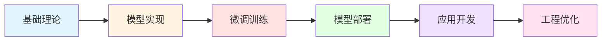

<div align="center">

# 🚀 大语言模型学习之旅

**Large Language Model Learning Repository**

*从理论到实践，从微调到应用，记录我的 LLM 探索历程*

---

[](https://www.python.org/)
[](https://pytorch.org/)
[](https://www.langchain.com/)
[](LICENSE)

</div>

---

## 📖 项目简介

本仓库是我系统学习大语言模型（LLM）技术的完整记录，涵盖从底层原理到实际应用的全流程实践。

### 🎯 学习目标

- 📚 **理论基础**: 深入理解 Transformer 架构、注意力机制、预训练与微调原理
- 🛠️ **工程实践**: 掌握模型训练、量化、部署的完整工程链路
- 🎨 **应用开发**: 基于 LLM 构建实用的 AI 应用（RAG、Agent、多模态等）
- 🔬 **技术探索**: 跟踪前沿技术，实验最新的模型与方法

---

## 📚 学习资源

### 核心教材
- 📘 **《从零构建大模型》** - 理论基础与模型实现
- 📗 **《大模型应用开发极简入门》** - LangChain 与应用开发

### 课程项目
- 🎓 **人工智能课程设计** - LLM 本地部署与 RAG 实现
- 🏆 **期末大作业** - 综合应用项目

---

## 🗂️ 项目结构

```
LLM/
│
├── 📁 Build-LLM-From-Scratch/       # 《从零构建大模型》学习代码
│   ├── 01-transformer-basics/      # Transformer 基础实现
│   ├── 02-pretraining/             # 预训练技术
│   ├── 03-fine-tuning/             # 微调方法（LoRA, QLoRA 等）
│   └── 04-model-compression/       # 模型压缩与量化
│
├── 📁 LLM-App-Dev-Intro/            # 《大模型应用开发极简入门》代码
│   ├── 01-langchain-basics/        # LangChain 基础
│   ├── 02-prompt-engineering/      # 提示词工程
│   ├── 03-rag-systems/             # RAG 系统构建
│   └── 04-agent-framework/         # Agent 开发
│
├── 📁 LLM_DEPLOY/                   # 🌟 人工智能课程设计
│   ├── 01_model_setup.ipynb        # 模型部署与验证
│   ├── 02_rag_implementation.ipynb # RAG 系统实现
│   ├── rag_server.py               # Flask API 服务
│   ├── rag_chat.html               # Web 交互界面
│   └── README.md                   # 详细文档
│
└── 📁 Final-Project/                # 📝 期末大作业 (40 分)
    ├── paper/                       # 论文原文与翻译
    ├── analysis/                    # 批判性分析与总结
    ├── reproduction/                # 复现实验（可选）
    └── README.md                    # 项目说明
```

---

## 🎯 核心项目

### 🌟 [LLM_DEPLOY - 本地化部署与 RAG 系统](./LLM_DEPLOY)

**课程设计 | AI Course Design Project**

一个完整的本地 LLM 部署解决方案，包含：

- ✅ **本地化部署**: Qwen2.5-7B-Instruct-GPTQ-Int4 量化模型
- ✅ **检索增强生成 (RAG)**: 基于 LangChain + FAISS 的知识库问答
- ✅ **API 服务**: Flask 封装的 RESTful API
- ✅ **Web 界面**: 美观的前端交互界面
- ✅ **私有知识库**: 支持自定义文档导入

**技术栈**: PyTorch • AutoGPTQ • LangChain • FAISS • Flask

[📖 查看详细文档 →](./LLM_DEPLOY/README.md)

---

### 📝 [Final-Project - LLM 论文研读与分析](./Final-Project)

**期末大作业 (40 分) | Final Assignment**

论文精读、翻译、批判性分析与复现实验：

- 📄 **论文选择**: 2023 年后发表的 LLM 相关学术论文
- 🌐 **全文翻译**: 准确的中文翻译（非 AI 直译）
- 📊 **深度总结**: 背景、方法、实验、结论的结构化梳理
- 🔍 **批判性分析**: 创新点、局限性、伦理与社会影响
- 🔬 **复现实验**: 可选但加分 - 复现论文核心实验

**输出成果**: 6-12 页研究报告 + 可选的复现代码

[📖 查看详细要求 →](./Final-Project/README.md)

---

## 🛠️ 技术栈

<div align="center">

| 类别 | 技术 |
|:---:|:---|
| **深度学习框架** | PyTorch, TensorFlow |
| **LLM 框架** | Transformers, AutoGPTQ, vLLM |
| **应用开发** | LangChain, LlamaIndex |
| **向量数据库** | FAISS, Milvus, Chroma |
| **微调技术** | LoRA, QLoRA, P-Tuning |
| **部署工具** | Flask, FastAPI, Gradio |

</div>

---

## 📈 学习路线



1. **阶段一**: 理论基础（Transformer、注意力机制、Token化）
2. **阶段二**: 模型训练（预训练、微调、RLHF）
3. **阶段三**: 工程部署（量化、推理优化、服务化）
4. **阶段四**: 应用开发（RAG、Agent、多模态）
5. **阶段五**: 项目实战（端到端完整项目）

---

## 🎓 学习进度

- [x] 环境搭建与模型部署
- [x] RAG 系统实现（LangChain + FAISS）
- [x] API 服务开发
- [x] Web 前端集成
- [ ] Transformer 从零实现
- [ ] LoRA / QLoRA 微调实践
- [ ] Agent 框架开发
- [ ] 多模态模型探索

---

## 📝 笔记与总结

学习过程中的重要笔记和总结文档将统一存放在 `docs/` 目录：

- 📄 模型架构详解
- 📄 微调技术对比
- 📄 RAG 系统设计模式
- 📄 提示词工程最佳实践
- 📄 性能优化技巧

---

## 🤝 联系方式

如有问题或建议，欢迎通过以下方式联系：

- 📧 Email: [您的邮箱]
- 💬 GitHub Issues: [提交 Issue]

---

## 📜 开源协议

本项目采用 [MIT License](LICENSE) 开源协议。

---

<div align="center">

**⭐ 如果这个项目对你有帮助，欢迎 Star！**

*持续更新中 | Last Update: 2025-12-15*

</div>
